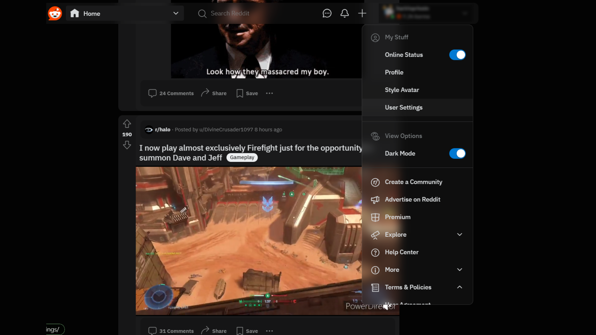
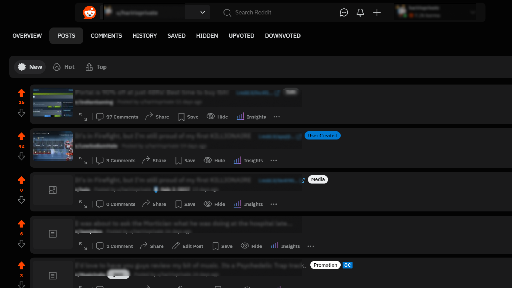

    

# Reddit Redesigned UserStyles CSS

Fork of Full Length Reddit Post. Overhauls some UI elements of Reddit to be more modern and lively looking, along with some quality of life updates.

This is a userStyles CSS sheet for Reddit.com that allows you to customize the appearance of the site.

## Screenshots

    
    
    

## Installation

1. Install a browser extension that supports userStyles, such as Stylus.
2. Create a new style in the extension and give it a name.
3. Copy the contents of the CSS file in this repository (`reddit-redesigned.css`).
4. Paste the CSS code into the style editor of the extension.
5. Save the style and make sure it is enabled.

## Usage

Once the userStyles CSS sheet is installed and enabled, it will automatically apply the custom styles to Reddit.com. You can customize the CSS code to modify the appearance of various elements on the site, such as colors, fonts, layout, etc.

## Contributing

If you have any improvements or suggestions for this userStyles CSS sheet, feel free to open an issue or submit a pull request in this repository.

